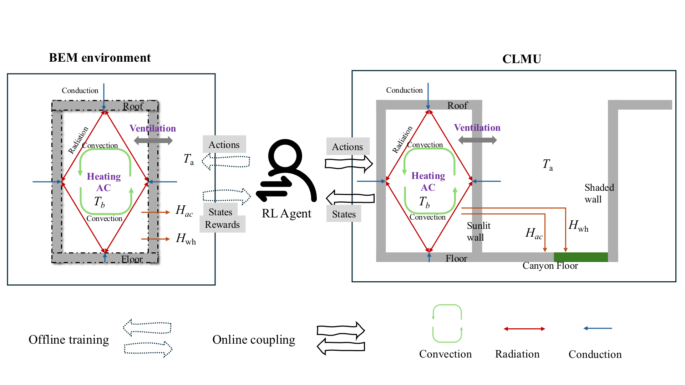

# Code of paper "*Reinforcement Learning (RL) Meets Urban Climate Modeling: Investigating the Efficacy and Impacts of RL-Based HVAC Control*" 

This repository is code of the manuscript "*Reinforcement Learning (RL) Meets Urban Climate Modeling: Investigating the Efficacy and Impacts of RL-Based HVAC Control*".

**Preprint**
```
@misc{yu2025reinforcementlearningrlmeets,
      title={Reinforcement Learning (RL) Meets Urban Climate Modeling: Investigating the Efficacy and Impacts of RL-Based HVAC Control}, 
      author={Junjie Yu and John S. Schreck and David John Gagne and Keith W. Oleson and Jie Li and Yongtu Liang and Qi Liao and Mingfei Sun and David O. Topping and Zhonghua Zheng},
      year={2025},
      eprint={2505.07045},
      archivePrefix={arXiv},
      primaryClass={cs.LG},
      url={https://arxiv.org/abs/2505.07045}, 
}
```

## Highlights

- RL-based HVAC control strategies are integrated with an urban climate model. 
- RL strategies effectively balance energy use and thermal comfort in HVAC.
- The impact of RL strategies on local urban climate varies across cities. 
- RL models trained in climate-diverse cities generalize more effectively. 

## Framework

This study employs the **Community Land Model Urban (CLMU)**, a process-based urban climate model that couples a **building energy model (BEM)** to simulate the building energy consumption and interactions between indoor climate and the local urban climate. 

The Python version of BEM (CLMUX in this repo) is used solely as a surrogate model to construct the RL environment and train the RL agents. The inference was built by saving the neural network weights and biases and leveraging the built-in `matmul` function of Fortran, which performs matrix multiplication on numeric arguments, to execute the neural network calculations. The inference process, including network parameters loading and action sampling, is implemented in a module named `sac_actor.f90`. This module is called within the BEM of CLMU in the `UrbBuildTempOleson2015Mod.F90` file of CLMU. In each step, subroutines in `sac_actor.90` are called, and the AC set point temperature, heating set point temperature, and ventilation intensity are updated based on current states. BEM then proceeds with its calculations as usual and outputs results for the next time step. 



## Repo structure

- clmux: code for Python version of CLMU/BEM

- clmux_val: validation of clmux with CLMU/BEM

- data: research data

    - get_clmu: run the original clmu model

    - get_sac_model: get SAC model weight and bias to netcdf file from Pytroch model

    - run_clmu_sac: run clmu with embedded SAC model

    - clmu_input: input for running simulations

    - ploting: scripts for plotting

- scripts: scripts for trainning RL agents using CLMUX-based environment.

- src: algorithms of RL, clmux Gym environment for RL agent training
  
    -  source code for RL models
    -  source code for CLMUX-based environment
    -  clmu: the modified source code for embedding SAC in CLMU (Fortran)

## Usage of code

Note: we are using `wandb` for recording the training of RL. If not used, please set the parameter `track` to false in `train.sh`. 

**1 Create the environment**
```bash
conda create env -f environment.yml
```
**2 Run CLMU simulations and get initial data for baseline and CLMUX input**
```bash
cd data
bash get_clmu.sh
```

**3 Train model**
```bash
cd scripts
bash train.sh
```

**4 Run CLMU with embedded SAC model**
```bash
cd data
bash get_sac_model.sh # get SAC model (save as nc file)
bash run_clmu_sac.sh # Run CLMU with embedded SAC model
```

**5 Run CLMU with embedded transferred SAC model**
```bash
cd data
bash run_clmu_sac_transfer.sh
```

**6 Analysis**
```bash
cd data/plotting
# Run all notebooks to generate the figures.
```

## How to ask for help
The [GitHub issue tracker](https://github.com/envdes/code_CLMU_HVAC_RL/issues) is the primary place for bug reports. Also feel free to chat with [Junjie Yu](https://junjieyu-uom.github.io/) (yjj1997@live.cn / junjie.yu@postgrad.manchester.ac.uk). We are happy to discussion any question on code and research. 