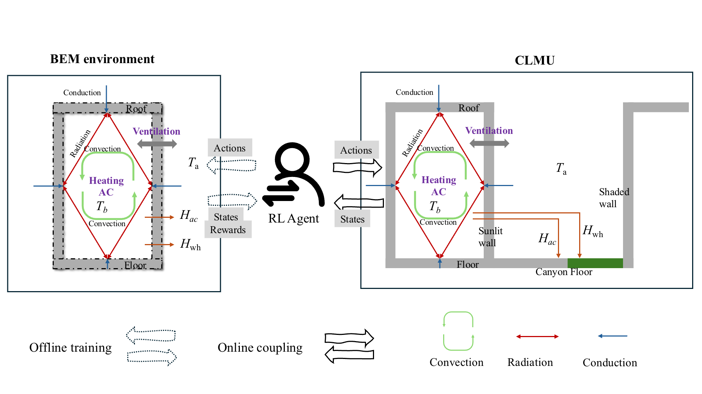

# Code of arXiv Preprint "*Reinforcement Learning Heating Control under Two-Way Interactions between Building Energy Use and Urban Climate*" 

This repository is code of the manuscript "*Reinforcement Learning Heating Control under Two-Way Interactions between Building Energy Use and Urban Climate*".


## Framework

This study employs the **Community Land Model Urban (CLMU)**, a process-based urban climate model that couples a **building energy model (BEM)** to simulate the building energy consumption and interactions between indoor climate and the local urban climate. 

The Python version of BEM (CLMUX in this repo) is used solely as a surrogate model to construct the RL environment and train the RL agents. The inference was built by saving the neural network weights and biases and leveraging the built-in `matmul` function of Fortran, which performs matrix multiplication on numeric arguments, to execute the neural network calculations. 



## Repo structure

- clmux: code for Python version of CLMU/BEM

- clmux_val: validation of clmux with CLMU/BEM

- data: research data

    - get_clmu: run the original clmu model

    - get_dqn_model: get DQN model weight and bias to netcdf file from Pytroch model

    - run_clmu_sqn: run clmu with embedded DQN model

    - clmu_input: input for running simulations

    - plotin_w: scripts for plotting

- scripts: scripts for trainning RL agents using CLMUX-based environment.

- src: algorithms of RL, clmux Gym environment for RL agent training
  
    -  source code for RL models
    -  source code for CLMUX-based environment
    -  clmu: the modified source code for embedding SAC in CLMU (Fortran)

## Usage of code

Note: we are using `wandb` for recording the training of RL. If not used, please set the parameter `track` to false in `train_w.sh`. 

**1 Create the environment**
```bash
conda create env -f environment.yml
```
**2 Run CLMU simulations and get initial data for baseline and CLMUX input**
```bash
cd data
bash get_clmu.sh
```

**3 Train model**
```bash
cd scripts
bash train_w.sh
```

**4 Run CLMU with embedded SAC model**
```bash
cd data
bash get_dqn_model.sh # get SAC model (save as nc file)
bash run_clmu_dqn.sh # Run CLMU with embedded SAC model
```

**6 Analysis**
```bash
cd data/plotting_w
# Run all notebooks to generate the figures.
```

## How to ask for help
The [GitHub issue tracker](https://github.com/envdes/code_CLMU_HVAC_RL/issues) is the primary place for bug reports. Also feel free to chat with [Junjie Yu](https://junjieyu-uom.github.io/) (yjj1997@live.cn / junjie.yu@postgrad.manchester.ac.uk). We are happy to discussion any question on code and research. 